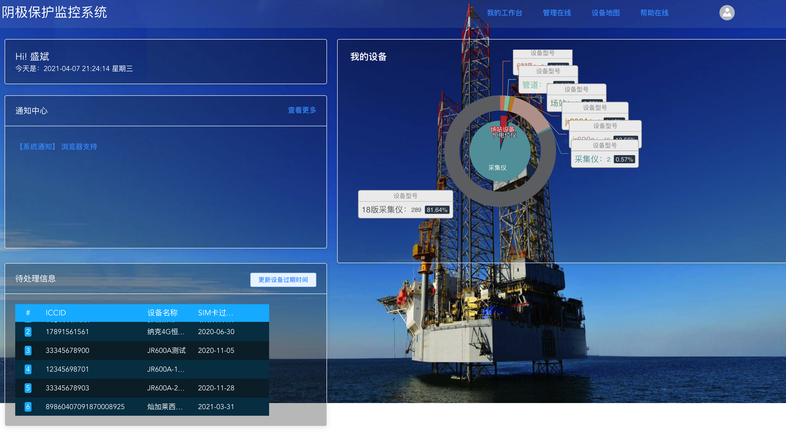
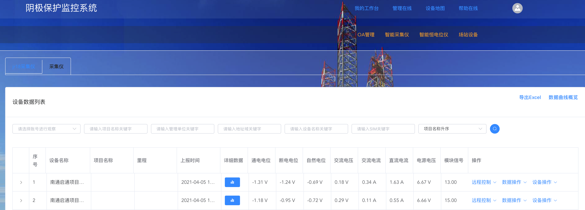
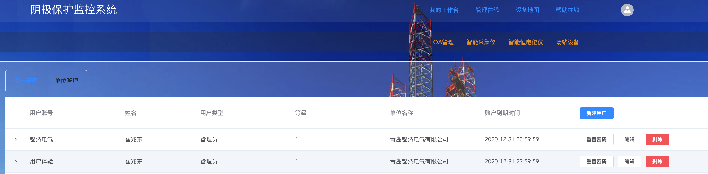
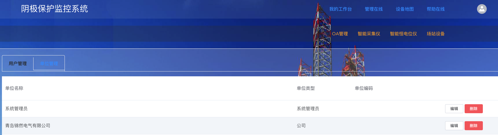
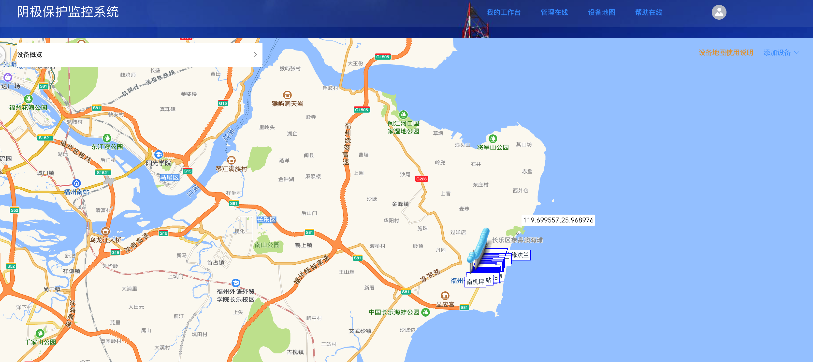

# 平台使用说明
## 文档说明
1. 文档中图片请右键在新页面或新标签页放大缩小。
2. 文档中有疑问请联系技术支持，或在关于文档中查看技术支持联系方式。

## 注册
1. 本平台使用账号发放方式，账号获取请联系系统管理员。

## 登录
1. 使用系统管理员发放账号密码进行登录。
2. 若忘记密码，请联系系统管理员或技术支持。

## 更新
1. 平台最新版本均在 [阴极保护系统平台官网](http://jr-gprs.cn) 更新，因各用户部署环境不同，若需升级请联系技术支持

## 我的工作台

### 1. 待处理信息
- SIM卡将要过期或已经过期的设备信息，用来提醒
- 点击更新设备过期时间，可获取所有18版采集仪设备过期时间。
### 2. 通知中心
- 系统管理员发放的需要注意的通知事项。
### 3. 我的设备
- 目前登录账户所拥有的设备类型环形图。
### 4. 今日提醒
- 当前登录用户名及今日日期提示
## 管理在线
### 1. 智能采集仪

1. 17版采集仪   
	- 采集数据只有电位测量和交流干扰电压两种类型

2. 18版采集仪
    - 多种数据类型

3. 采集仪通用功能
	- 添加设备
		1. 请在设备地图中右上角进行添加。
	- 辅助操作     
		1. 搜索   
			根据各个输入框条件进行搜索，可以联合搜索。
		2. Excel 导出   
			导出当前页面设备信息
		3. 数据曲线概览   
			图形化方式查看当前页面设备数据
	- 详细数据   
		+ 查看单个设备的所有历史数据，并且可以根据日期进行选定。

		+ 编辑或删除某条历史数据。

		+ 生成当前选定日期的Excel

		+ 将表格模式转为图形化模式。

	- 数据操作   
		- 添加数据：根据设备字段添加数据。
		- 设置报警值：若超出报警值限制，则在设备地图中变红显示。
	- 设备操作   
		1. 编辑设备信息   
			根据弹出页面所需信息编辑设备信息。
		2. 删除设备   
			永久删除设备
		3. 设备过户
			将该设备移动到另一账户下，归属权仍按等级制度计算。
	- 远程控制   
	-远程设参：
	对采集仪进行参数远程设定，具体设定格式及各参数内容请询问锦然电气有限公司。

### 2. 智能恒电位仪
1. 通用说明   
	- jr200a与jr600a的gprs通信与采集仪不同，为json格式字符串，具体请联系技术支持。
	- 恒电位仪为1个通信模块携带多台恒电位仪设备，地址域为通信模块地址域。
	- 恒电位仪设备操作均与采集仪相同。
2. jr200A恒电位仪
3. jr600A恒电位仪

### 3.场站设备
1. 说明   
	+ 场站设备为储罐、管道等场站设施管理功能。

### 4.OA管理
1. 说明   
	+ OA管理为基本的用户及单位管理
2. 用户管理   

	+ 用户账号、姓名、类型等用户关键信息的列表查看。
	+ 新建用户
	+ 重置密码。
	+ 编辑用户信息或删除用户。
3. 单位管理 

	+ 单位名称、类型信息的列表查看。
	+ 编辑或删除单位信息。
	+ 只能在添加用户时添加单位。

## 设备地图

### 1. 地图中设备图标显示与更改
- 需要在 <i>设备管理-设备操作-编辑设备信息</i> 中进行设备图标更改。
### 2. 地图左上角设备概览
- 点击此栏可以展开并显示当前地图中所有的设备概况，并可以进行设备名称索引及定位功能，帮助用户快速搜索并定位到某设备地点。
### 3. 地图右键功能
- 可以保存当前地图状态，包括当前地图缩放等级、鼠标所在位置的经纬度等信息，用户下次进入设备地图时，会定位到保存时的地点进行查看。
### 4. 设备右键功能
1. 移动设备
    - 点击此功能后，移动鼠标即可对设备位置进行移动，再次点击鼠标左键时，将把设备放到此位置。
2. 删除设备。
### 5. 设备左键功能
- 打开当前设备的数据概况。
### 6. 右上角添加设备
- 根据弹出页面所需信息，添加各种类型设备。

## 帮助在线
略

## 用户个人中心
* 说明  
        用户功能包括用户个人中心及工作台。
### 1. 工作台  
1. 通知公告
    - 包括系统通知公告的发布与管理，可以新建公告，编辑已有公告，删除已发布的公告信息。
2. 系统信息
    - 此功能为系统0级账号才能使用。
    - 包括修改首页显示信息、功能是否显示
3. 系统信息栏
    - 在此功能栏中可以对系统目前信息进行修改，包括系统名称、logo、首页备案号等信息。    
        需要说明的是，logo需要png格式，否则可能导致logo背景空白，影响美观，并且在上传一次logo之后，不能对现在的logo进行删除，需重新上传
4. 功能显示栏
    - 该栏可以对目前功能栏进行选择性显示，已勾选的功能将在系统功能页面进行显示，否则不显示。包括设备类型显示、栏目等
### 2.个人中心
- 用户个人信息修改，包括用户密码、联系方式等
- 用户个人信息查看
- 退出账号